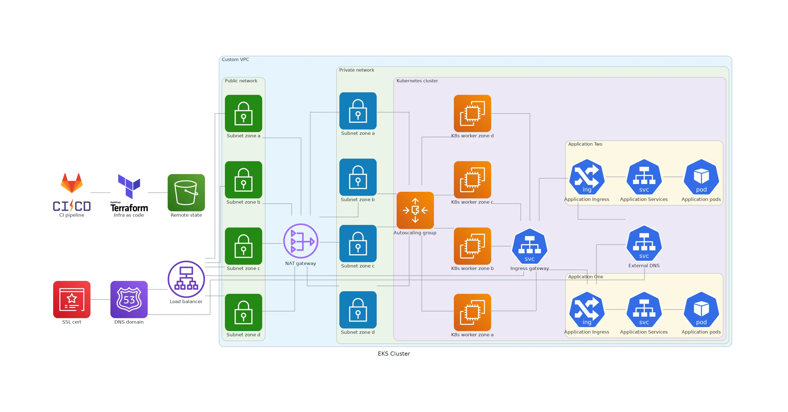

# EKS CLUSTER + VPN

Brief project description or tagline.

## Table of Contents

- [EKS CLUSTER + VPN](#eks-cluster--vpn)
  - [Table of Contents](#table-of-contents)
  - [Introduction](#introduction)
  - [Architecture Overview](#architecture-overview)

## Introduction

Provide a brief introduction to the project, its purpose, and any relevant background information.

## Architecture Overview

Explain the architecture of your AWS EKS setup. Include diagrams and visual representations for better understanding.

